# Final Week of Yale
Final Week of Yale

Final Week of Yale

Friday, December 4, 2020

6:28 PM

12/3/2020

Started playing Total Warhammer II. It is so fun! Definitely a turner.
Final discussion with Armando. Intriguing

12/4/2020

Last CASA Meeting

Yearly naked run.

12/5/2020
Catching up with Vanoss. Clearing up my Spotify.

Organized my Spotify and enabled Field Surround for center audio!
34+35 is so amazing! Especially with Field Surround on my phone.

12/6/2020
Finished my Math Assignment and watched JVNA and NA Finals!

Had a hilarious call with Gays Hopper. Firsat Alabama hot pocket

12/7/2020
Call with Armando. He said that I had the best discussion this week and my writing has a flair and is well written! Very great to hear.

Also ran through Cristosal proposal, some Among Us videos with Bryce (the 3 imposters video led us down a rabbit hole of so many others and then a 2015 compilation), Tiffany Ong Stanford videos, and more! Cyberpunk also came out which is epic.

12/8/2020

Had a great insightful post in CS201! Showed off my expertise in time complexity :) I'm an OP software engineer.

@Argyris Giannisis pretty sure you can use length, just mind where you call it. what I did was called it length only once outside the for loop/helper function and stored it in a variable (then called the variable instead of length in the for loop). Even though length is still O(n), calling it outside the loop avoids O(n^2) and since merge runtime is o(nlogn) the o(N) outside doesn't affect computational time that much

Na'Vi vs. Astralis. AMAZING GAME

Na'Vi clutched 10 rounds in a roll without more than one person dying each round to win on Nuke.

On Dust2, Astralis won 10 in a row to almost win. Then Na'Vi turned back on and won! There were so many rounds that came down to the wire, and then several kills on the Na'Vi side suddenly changed the entire tide of the game.

12/9/20
Finished my Philosophy Paper! Then also watched Dream against 4 Hunters.

12/10/2020

Na'Vi vs. Vitality. Great game! Super close, although Na'Vi ultimately lost it was overtime in both maps and super close.

Finished my Chinese final! Phew. :)

Went down a Kyle Landry rabbit hole. So fun to listen to! Printed a bunch of stuff

12/11/20
Customized my iTerm terminal!

Final brainstorming with
Maeva

12/13/2020
Working on my essay. Nice texts with Olivia and Nina. Yvonne sent me a care package and I'm so happy omg. Had a great meeting with Professor Ehrgood.

12/15/2020
Viewed my Yale Admissions file! Was absolutely enlightening to see my files. I got a 2+ on both evaluations. Both agreed that Ms. Hatheway's rec letter was absolutely insane! Also my interview with Jeff. Jeff left such kind comments and extensive!

Helped talk with Dad about issues with the Stimulus check. Shopped around for some iPad Pros! I will likely get the 2017 iPad Pro with the pencil. I also started clearing out my Gmail and watched Na'Vi vs. Furia. S1mple had some amazing clutches! There was one where he hit a deag, then Electronic hit two deags, then Perfecto hit two deags, and that was absolutely insane.

Cleared out my inbox. Sorting out some miscommunication with Dad. I really had some good practice deescalating conflict.

12/16/2020
Crazy game of Astralis vs. BIG! Syrson was insane with Scout peaks on Vertigo and Dust2. He had a 1v1 knife kill on long that was absolutely insane!

12/17/2020
Played lots of piano. Beauty and the Beast is going so well now! Incorporating some pedal to great effect. Na'Vi vs. Liquid! It was a great watch with Simple's insane AWP 1v2 on Nuke, then 3k on an eco. Perfecto did great on Mirage too with three essential clutches!

12/18/2020
Astralis vs. Vitality. Astralis won! Crazy game especially to come back on Dust 2 and close on Inferno (they did really trash on first map Nuke, lost 16-2, then came back!)
Finished Math 230 Final! It was a great time. So glad finals are over!
Listened to Eminem's new album with Bryce. We listened to the base vibrate from my setup.
Played some Borderlands 2. So happy we had WeMod! Wouldn't have had this opportunity if Bryce hadn't lost his save in Killing Floor.

12/19/2020
Visited Best Buy. Called Grandpa

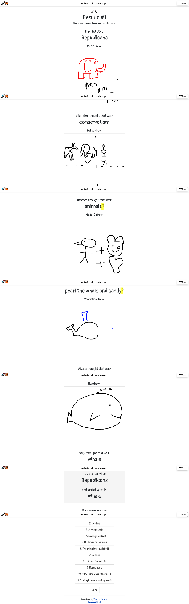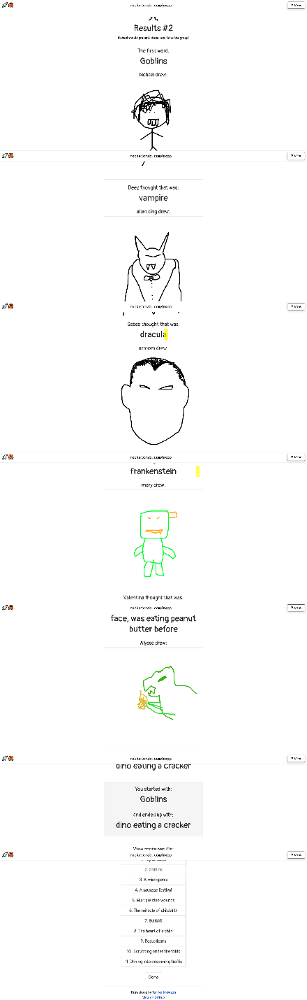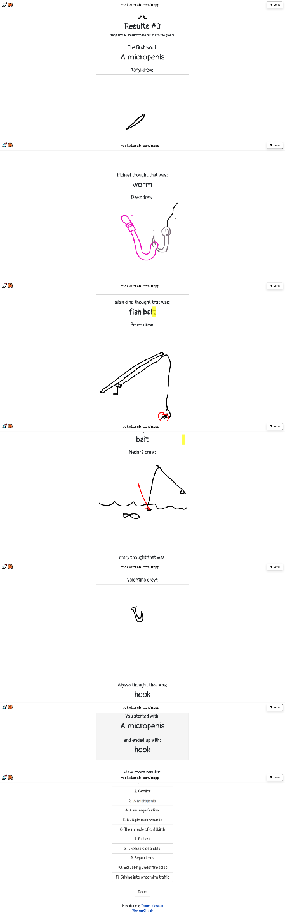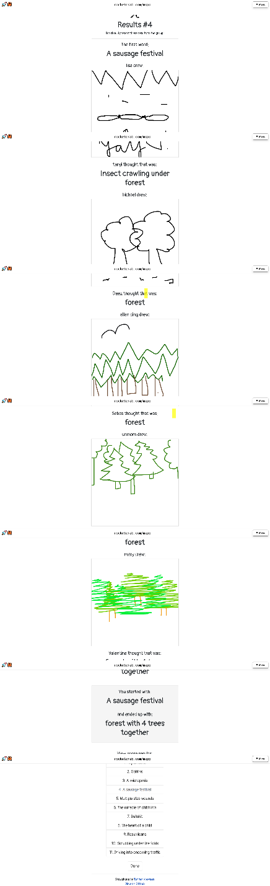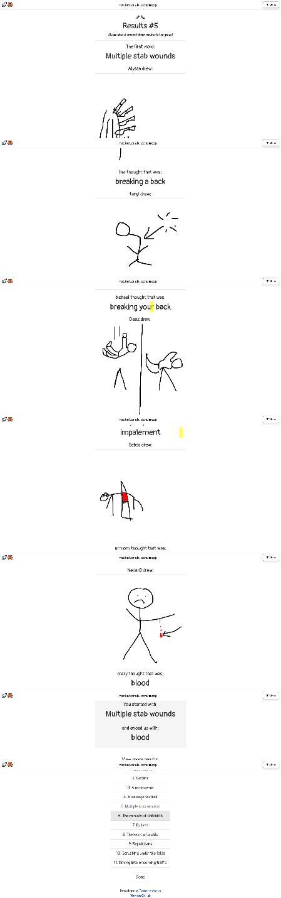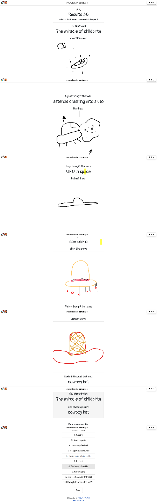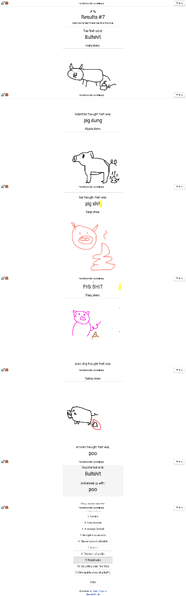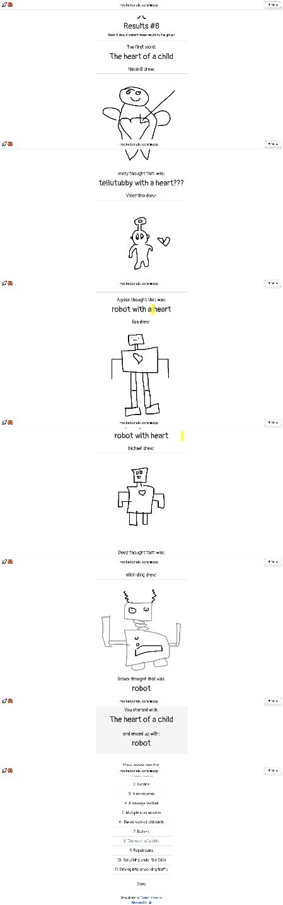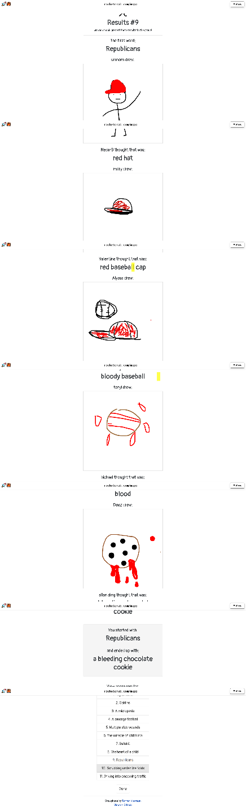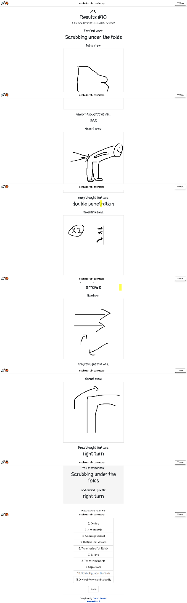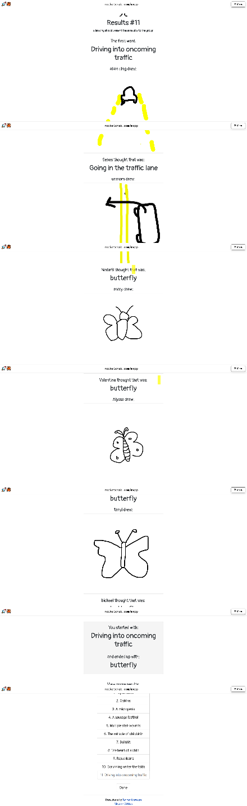
