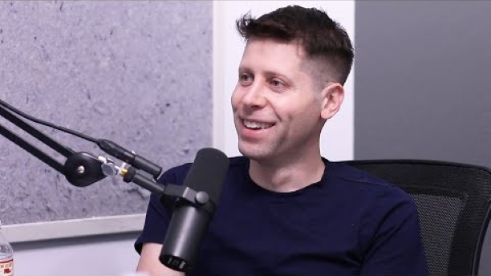

# Ultimate Tips
Ultimate Tips

Ultimate Tips

Friday, December 13, 2019

5:53 PM

 

[5 Psychological Tricks You’re Not Taught In School](https://www.youtube.com/watch?v=lykvHGNo9yE)

 

 

1. End on the best thing

2. Double bind

	1. "I know that you're probably going to be skeptical about this, and quite frankly, if you weren't, I would think something is quite wrong with you"

		1. Agree

			1. Leading conversation

			2. Explain why they're skeptical, why you are skeptical, and you come around as having an open mind

		<!-- -->

		1. Disagree

			1. They convince themselves that they are open-minded

<!-- -->

1. Let's say this interview went really well. A year later, what would be something I need to do to make sure a job well done?

	1. They visualize you succeeding

	2. Have you ever made an exception?

<!-- -->

1. Frame

	1. Use you frames, not I frames

	2. "I wrote this. It means the world to me" vs. "I wrote this for your audience specifically. There's something in it I am trying to help out. No pressure but if you'd like to share it I think it could help you a lot."

<!-- -->

1. Scarcity

 

[Sam Altman on Choosing Projects, Creating Value, and Finding Purpose](https://www.youtube.com/watch?v=uEl2KUZ3JWA&list=WL&index=59)

 

 

 

Deferred life plans don't work
